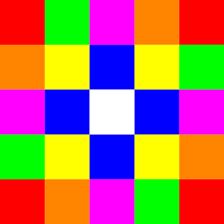

---

# Image Scaler

This Python application reads a low-resolution .png image and generates a scalable .svg version. The .svg file can be used as a high-resolution wallpaper. The application samples the colors of each hexagon to reproduce the same picture.

## How to use ?

1. Clone the repository.
2. Install the tool and necessary libraries using: `poetry install`.
3. Use it: `poetry run main [--help] [-g {hexagonal,square}] [-p {random,average,frequent}] [-s SIZE] image_path`.

**Note:** for more details about all the available params use the following command: `poetry run main --help`.

## Examples

<table>
    <tr>
        <td>Original Image</td>
        <td>Generated SVG</td>
    </tr>
    <tr>
        <td>
            
        </td>
        <td>
            
        </td>
    </tr>
    <tr>
        <td>
            
        </td>
        <td>
            
        </td>
    </tr>
</table>

## Materials & Notes:

This are for people who want to dig in hexagonal grids & know how to deal with it. Ignore if you only want to use the tool.

- https://www.redblobgames.com/
- https://www.geeksforgeeks.org/creating-svg-image-using-pycairo/
- https://gamedev.stackexchange.com/a/61101

## Docs Building Notes

- `poetry add sphinx --dev`: to install sphinx.
- `poetry run sphinx-apidoc -o docs/ src/`: to generate the .rst files for each module. This command should be run each time you have a new module or there is some changes in one of your modules.
- `poetry run sphinx-build -b html docs docs/_build`: to build the documentation. Each time there is a change.

## Upload to Pypi

- `poetry config http-basic.pypi __token__ <api-toke>`: to specify your pipy credentials.
- `poetry build`: build the project.
- `poetry publish`: to publish the builded project into pypi.
