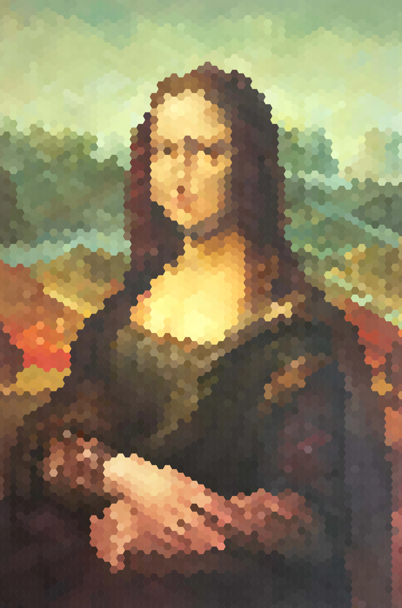

---

# Image Transformer

Image Transformer is a CLI tool and a python module that can do two things:

- Reads a .png image and generate a scalable .svg version of that image based on a hexagonal, triangular or square grid (or any other grid you which to implement).
- Generate a svg image from a color palette with the grid of your choice.

The a scalable .svg version generated or transformer can be used as a high-resolution wallpaper.

## Install

```bash
pip install image-transformer
```

## How to use as a CLI tool ?

### The `transform` command

Command to transform an image using specified processors and save the output. This command allows you to transform an image using various processors for the image, pixels, and output. The transformed image is then saved to the specified output directory.

```bash
image-transformer transform mona-lisa.png
```

Below all the available parameters:

| Parameter                | Is Required | Default         | Description                                                                               |
| ------------------------ | ----------- | --------------- | ----------------------------------------------------------------------------------------- |
| `--image-path`           | Yes         |                 | Specify the path to the image to be transformed.                                          |
| `--image-processor`      | Yes         | `hexagonal`     | Type of grid to use (options: `hexagonal`, `square`, `triangle`).                         |
| `--pixels-processor`     | Yes         | `most-frequent` | Specify the pixels processor to use (options: `random`, `most-frequent`, `average`, etc). |
| `--output-builder`       | Yes         | `cairo-svg`     | Specify the output builder to use.                                                        |
| `--size`                 | Yes         | `10`            | Size of the grid cells. Default is `10`.                                                  |
| `--output-directory`     | Yes         | `./`            | Specify the directory where the output image will be saved.                               |
| `--verbose/--no-verbose` | No          | `True`          | Enable or disable verbose output.                                                         |

**Note:** for more details about all the available params use the following command: `image-transformer transform --help`.

Assuming you have an file in the same directory from where you are running the command named `mona-lisa.png` containing an image.

### The `generate` command

Generate an image with specified dimensions, colors, and processing options.

```bash
image-transformer generate --width 200 --height 100
```

Below all the available parameters:

| Parameter                | Is Required | Default                | Description                                                                               |
| ------------------------ | ----------- | ---------------------- | ----------------------------------------------------------------------------------------- |
| `--image-processor`      | Yes         | `hexagonal`            | Type of grid to use (options: `hexagonal`, `square`, `triangle`). Default is `hexagonal`. |
| `--size`                 | Yes         | `10`                   | Size of the grid cells. Default is `10`.                                                  |
| `--width`                | Yes         | `100`                  | Specify the width of the generated image.                                                 |
| `--height`               | Yes         | `100`                  | Specify the height of the generated image.                                                |
| `--hex-color`            | Yes         | A random color palette | Specify the hex color code for the image background.                                      |
| `--output-builder`       | Yes         | `cairo-svg`            | Specify the output builder to use.                                                        |
| `--output-directory`     | Yes         | `./`                   | Specify the directory where the output image will be saved.                               |
| `--verbose/--no-verbose` | No          | `True`                 | Enable or disable verbose output.                                                         |
| `--help`                 | No          |                        | Show help message and exit.                                                               |

**Note:** for more details about all the available params use the following command: `image-transformer generate --help`.

## How to use in a program ?

Example usage:

```py
from PIL import Image

from image_transformer import ImageTransformer
from image_transformer.output_builders import CairoSvgOutputBuilder
from image_transformer.image_processors import HexagonalGridImageProcessor
from image_transformer.pixels_processors import MostFrequentPixelsProcessor

def main():
    hexagon_size = 13
    output_image_path = "result.svg"
    # NOTE: assuming the image exists
    my_image_path = "./mona-lisa.png"

    image = Image.open(my_image_path)

    transformer = ImageTransformer.from_pil_image(image)

    output_builder = CairoSvgOutputBuilder(image.width, image.height, output_image_path)
    image_processor = HexagonalGridImageProcessor(hexagon_size)
    pixels_processor = MostFrequentPixelsProcessor()

    transformer.transform_and_save(
        image_processor=image_processor,
        pixels_processor=pixels_processor,
        output_builder=output_builder
    )

if __name__ == "__main__":
    main()
```

## Examples

### Image Transformation

<table>
    <tr>
        <td>Original Image</td>
        <td>Hexagonal SVG Version</td>
    </tr>
    <tr>
        <td>
            
        </td>
        <td>
            
        </td>
    </tr>
    <tr>
        <td>
            
        </td>
        <td>
            
        </td>
    </tr>
</table>

### Image Generation

<table>
    <tr>
        <td>Generated Image</td>
    </tr>
    <tr>
        <td>
            
        </td>
    </tr>
</table>

## Development and Contributions

Below are notes for development only. You don't need to give it a look unless you want to contribute or build your own library.

### Materials & Notes:

This are for people who want to dig in hexagonal grids & know how to deal with it. Ignore if you only want to use the tool.

- https://www.redblobgames.com/
- https://www.geeksforgeeks.org/creating-svg-image-using-pycairo/
- https://gamedev.stackexchange.com/a/61101

### Docs Building Notes

- `poetry add sphinx --dev`: to install sphinx.
- `poetry run sphinx-apidoc -o docs/ image_transformer/`: to generate the .rst files for each module. This command should be run each time you have a new module or there is some changes in one of your modules.
- `poetry run sphinx-build -b html docs docs/_build`: to build the documentation. Each time there is a change.

### Upload to Pypi

- `poetry config http-basic.pypi __token__ <api-toke>`: to specify your pipy credentials.
- `poetry build`: build the project.
- `poetry publish`: to publish the builded project into pypi.

### About Poetry

[Poetry Scripts Section](https://github.com/python-poetry/poetry/issues/241#issuecomment-470200353):

> It looks like there is a desire for developer/project specific helper scripts, but that's not what [tool.poetry.scripts] is for. As mentioned, scripts are entrypoints into a python packages. This section's purpose is for libraries to install useful command line tools. Libraries like pytest, poetry, and the aws cli would use this scripts section so you can call their tool from the command line.

[Reason why they don't add a `dev-scripts` section](https://github.com/python-poetry/poetry/issues/241#issuecomment-470212635).

[ ] Poetry support multi language ?
